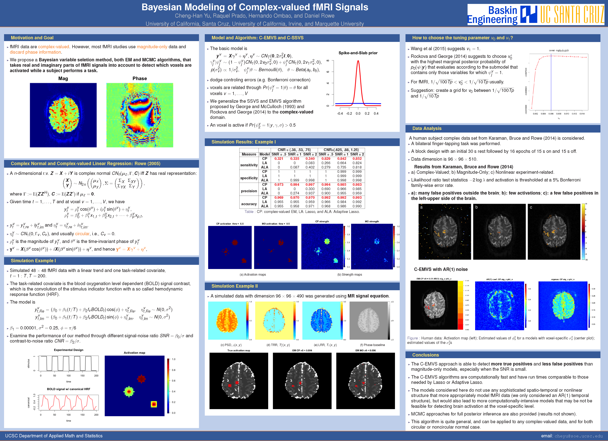

My current research focuses on Bayesian spatio-temporal modeling and Bayesian variable selection with applications in brain imaging, complex-valued fMRI signals in particular.

# Publications
## Papers under review
- **Yu, C. H.**, R. Prado, H. Ombao, and D. Rowe (2016). A Bayesian Variable Selection Approach Yields Improved Brain Activation From Complex-Valued fMRI. 


## Published papers
- Feldman, S.R., R. Balkrishnan, H. C. Lin, **C. H. Yu**, and S.A. Davis (2014). Underuse of Early Follow-Up Visits: A Missed Opportunity to Improve Patients' Adherence. *Journal of Drugs in Dermatology*, 13(7):833-836.
- Ueng, K.L.G. and **C. H. Yu** (2008). The Neutrality of Profit Tax - Two-Phase Decision Model Under Uncertainty of Economy. *Taiwan Public Finance Review*, 40, 4, 118-130.
- **Yu, C. H.** (2005). Master thesis: *The Output and Tax Evasion Decisions of Monopolistic Firm - Under the Conditions of Limited Liability and Market Uncertainty.*


## Technical reports
- Liu, S. Z., **C. H. Yu**, F. H. Lin, W. L. Wang, C. L. Wu (2008). Research on Regional Characteristics, Industry Clusters and Competitiveness Assessment Index of Taiwan Districts, granted by National Science Council, Taiwan.

## Current research projects
*Bayesian spatial hierarchical modeling of complex-valued fMRI signals*, with Prof. Raquel Prado.


## Conference posters
- *Bayesian modeling of complex-valued fMRI signals*, ISBA 2016 World Meeting, June 2016, Sardinia, Italy, International Society for Bayesian Analysis

<!--


```{r, out.width = "1400px", echo=FALSE}

```

[](http://google.com.au/)
-->


<!-- class="download" -->


<a href="./figures/posterfmriisba.png" title="PosterISBA2016" align="middle">
<center>
</center>
</a>

<!-- <a href="./figures/posterfmriisba.png" download="posterfmriisba.png"></a> -->


<!--
<a download href="./figures/posterfmriisba.png" title="ImageName">
    
</a>
-->

- *Bayesian modeling of complex-valued fMRI signals*, Data Science Afternoon, May 2015, UC Santa Cruz

